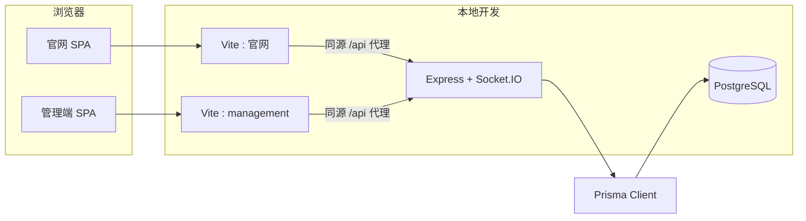
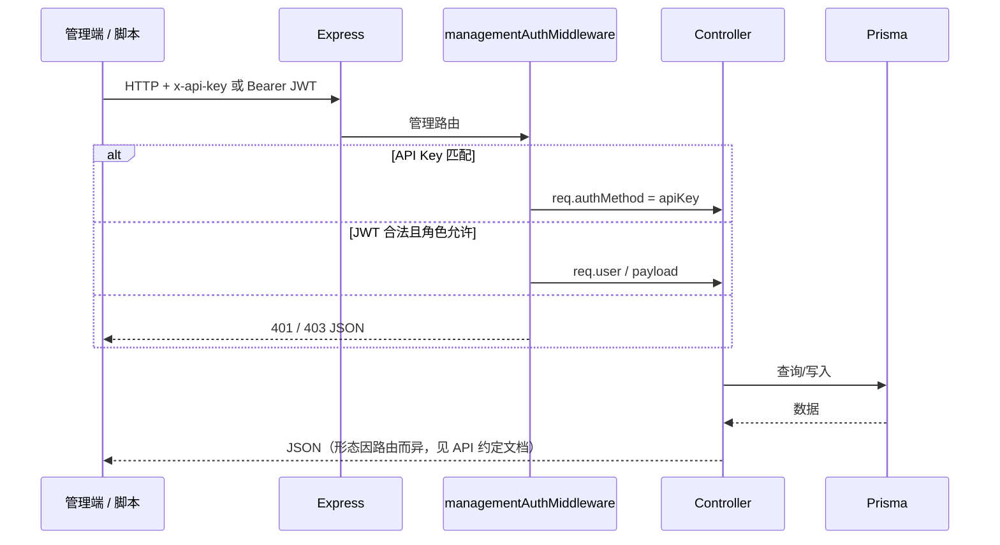
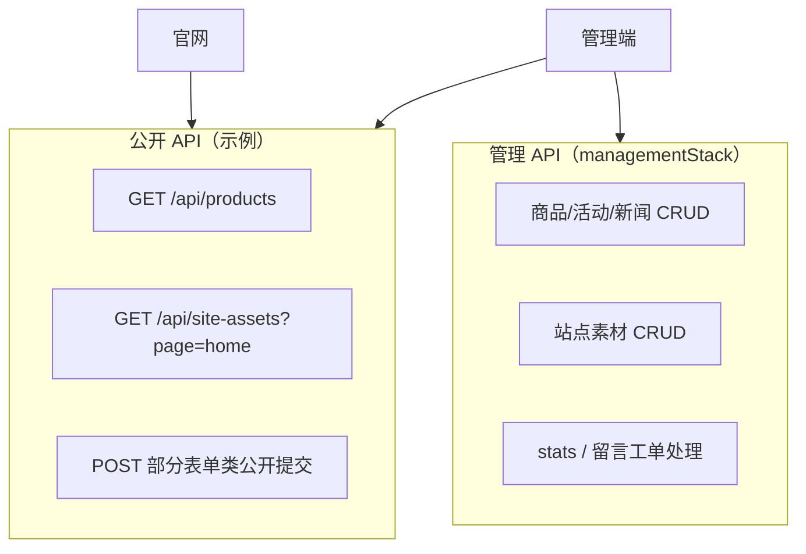
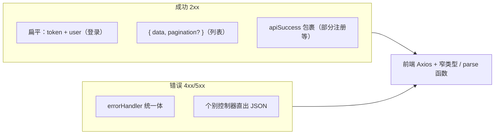
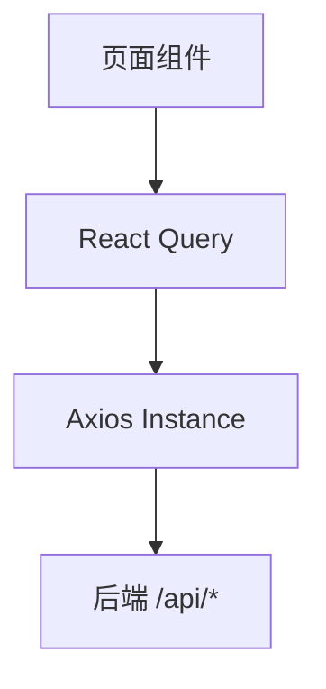

# Redwood Frontend Project

企业官网（`src/`）+ 管理后台（`management/`）+ 后端 API（`backend/`）。下文 **「项目总览」** 汇总架构、技术栈、数据流与接口分层（含 Mermaid 图），便于在 GitHub 首页直接阅读。

## 常用命令

```bash
npm install
npm run dev                    # 仅官网前端（默认 http://localhost:5173），不会自动启动后端
npm run dev:management         # 仅管理端，默认 http://localhost:3001（/api 代理到后端 3000）
npm run build                  # 官网生产构建
npm run build:management       # 管理端构建
npm run check:management-api   # 检查后端 /health 与 Vite 代理配置（联调前可跑）
npm run start:all              # 后端 + 双前端 + Prisma Studio（需本机 PostgreSQL 与 backend/.env）
```

**联调说明**：`npm run dev` 只启动官网 Vite；首页等页面从 `GET /api/site-assets?page=home` 拉取素材（**全量**，含外链或 Base64 图），需另开终端运行 `npm run dev --prefix backend`（或使用 `npm run start:all`）。**管理端「站点素材」列表**使用 `GET /api/site-assets?omitImage=1`，不在列表响应中序列化 BYTEA，避免大图多时 JSON 过大导致 500。更新 `siteAsset` 种子后请在 `backend` 目录执行 `npm run seed`（或项目约定的 seed 命令）再刷新页面。

管理端接口连不上时，见 [docs/management-api-troubleshooting.md](docs/management-api-troubleshooting.md)。

```bash
cd backend && npm install && npm run dev
```

环境变量参考：`backend/.env.example`、根目录 `.env.example`、`management/.env.example`。

## 后端健康检查（部署探针）

- `**GET /health**`：仅表示 Node 进程在跑，负载均衡可用来做最轻量存活检查。
- `**GET /health/ready**`：对数据库执行 `SELECT 1`；**数据库不可连时返回 HTTP 503**，适合作为 Kubernetes `readinessProbe` 或 Docker `HEALTHCHECK`，由编排器在失败时重启实例或摘流。全局速率限制已跳过上述路径。

Docker 示例：

```dockerfile
HEALTHCHECK --interval=30s --timeout=5s --start-period=20s --retries=3 \
  CMD wget -qO- http://127.0.0.1:3000/health/ready || exit 1
```

Kubernetes 示例：`readinessProbe.httpGet.path` 设为 `/health/ready`，`port` 与容器内后端监听端口一致（默认与 `PORT` 环境变量相同，常见为 3000）。

## API Key（`API_KEY` / `VITE_API_KEY`）

- **必须一致**：后端环境变量 `API_KEY` 与官网、管理端构建时的 `VITE_API_KEY` 须相同，否则带 `x-api-key` 的请求会返回 401。本地默认均为 `default-api-key`（见各目录 `.env.example`）。
- **浏览器可见**：官网与管理端会在请求头中发送 `x-api-key`。该值会进入前端打包产物，用户也可在开发者工具的网络面板中看到。因此它**不是**机密，不能用来保护「只能内网知道」的数据。
- **实际语义**：凡走 [管理类中间件](backend/src/middleware/managementAuthMiddleware.ts)、且仅用 API Key（无 JWT）即可访问的读接口（例如 `GET /api/site-assets`、分页列表等），在密钥泄露意义下等同于**对持有站点的人可读**。若业务需要真正的私密数据，应改为登录态（JWT）+ 角色控制，或把敏感接口放到不暴露给浏览器的 BFF/内网服务。
- **生产建议**：为防脚本滥用可换成足够长的随机密钥，并在部署流水线中**同时**更新后端 `API_KEY` 与前端构建参数 `VITE_API_KEY`；不要将真实生产密钥提交到仓库。

更细的 JSON 响应形态说明见 [docs/api-response-conventions.md](docs/api-response-conventions.md)。

---

## 项目总览（架构 · 模块 · 数据流 · 接口）

面向需要快速理解 **Redwood / 林之源** 全栈仓库的开发者与评审者。细节以源码为准。

### 产品形态与仓库边界

| 子系统       | 目录          | 职责                                                             | 典型运行地址（本地）                                              |
| ------------ | ------------- | ---------------------------------------------------------------- | ----------------------------------------------------------------- |
| **官网**     | `src/`        | 企业站：首页、商城、活动、帮助、课程、价格、公司页、登录注册等   | Vite 默认端口（见 `vite-env-ports.ts` / `scripts/dev-ports.env`） |
| **管理后台** | `management/` | 商品/活动/新闻/站点素材/课程/定价/留言/工单等 CRUD；仪表盘与统计 | `management` 专用端口，`/api` 代理到后端                          |
| **后端 API** | `backend/`    | Express + Prisma + PostgreSQL；REST JSON；部分能力经 Socket.IO   | 默认与 `PORT` / `REDWOOD_PORT_API` 对齐                           |
| **共享代码** | `shared/`     | 前后端共用（如错误追踪 `wrapAxiosError`）                        | —                                                                 |

官网与管理端是 **两个独立的 Vite 应用**（不同 `vite.config`），共用同一后端与（部分）设计 token。

### 技术栈一览

| 层级           | 技术                                                                                                                                             |
| -------------- | ------------------------------------------------------------------------------------------------------------------------------------------------ |
| 语言与构建     | **TypeScript**、**Vite 5**、**ESM**                                                                                                              |
| 官网 UI        | **React 18**、**React Router 6**、**Ant Design 6**、**Less**                                                                                     |
| 官网状态与数据 | **Redux Toolkit**（主题等）、**TanStack React Query v5**（服务端状态）、**Axios**                                                                |
| 管理端 UI      | React、Ant Design、React Router、`@tanstack/react-query`                                                                                         |
| 校验           | **Zod**（后端入参；根依赖亦含 zod 供前端类型收窄）                                                                                               |
| 后端           | **Express**、**Prisma**、**PostgreSQL**、**Socket.IO**、**swagger-ui-express**                                                                   |
| 质量           | **ESLint**、**Prettier**、**Husky + lint-staged**、**Jest**（官网/管理单元测试）、**Playwright**（E2E）、后端 **Jest** 与回归 `contract.test.ts` |

### 仓库目录结构（逻辑视图）

```text
仓库根（包名 enterprise-frontend-framework）
├── src/                    # 官网应用
│   ├── components/         # 业务 Layout、UI、EventCalendar 等
│   ├── pages/              # 路由页面（Home、Shop、Company/* …）
│   ├── services/api/       # Axios 实例与 API 调用
│   ├── redux/              # store、主题等 slice
│   ├── router.tsx          # createBrowserRouter + 懒加载
│   └── assets/styles/      # 全局 Less、主题 token、营销页样式
├── management/src/         # 管理端应用（独立入口 main.tsx）
├── backend/src/
│   ├── createApp.ts        # 组装 Express、路由、中间件、Socket.IO
│   ├── routes/             # 按资源拆分；常分 public / management 子路由
│   ├── controllers/        # HTTP 处理
│   ├── schemas/            # Zod 校验
│   ├── middleware/         # 错误处理、限流、管理鉴权、JWT 等
│   ├── application/        # 用例层（如 site-asset）
│   ├── infrastructure/     # 持久化实现（如 repository）
│   ├── services/           # JWT、密码等
│   └── dao/                # 部分数据访问
├── shared/                 # 跨端模块
├── docs/                   # 约定、排障、补充说明
├── scripts/                # 端口、联调检查等
└── vite-env-ports.ts       # 开发端口聚合（读 dev-ports.env / backend .env）
```

### 运行时拓扑

开发环境下，浏览器只与 **Vite 开发服务器** 通信；由 Vite **代理** `/api`（及健康检查等）到 **Node 后端**。后端通过 **Prisma** 访问 **PostgreSQL**。



生产环境通常为：静态资源由 CDN / Nginx 托管，API 独立域名或同域反代；原理与上图一致（去掉 Vite，换成构建产物）。

### 请求与认证数据流

管理类接口在 `createApp.ts` 中挂载在 **management 中间件栈** 之后：`managementAuthMiddleware` →（可选）`adminUserReadOnlyMiddleware`。  
鉴权支持两种路径（见 `managementAuthMiddleware.ts`）：

1. **API Key**：请求头 `x-api-key` 与后端 `API_KEY` 一致（与前端构建时 `VITE_API_KEY` 对齐，见上文）。
2. **JWT**：`Authorization: Bearer <accessToken>`，且角色在 `MANAGEMENT_JWT_ROLES` 允许集合内。



官网匿名可读的资源（如 `GET /api/site-assets`、`GET /api/products` 等）走 **公开路由**，不经过上述管理栈；写操作与敏感列表在管理路由下保护。

### 后端路由与「公开 / 管理」拆分模式

`createApp.ts` 中为多数业务资源采用 **双 Router** 模式：

- `***PublicRouter`\*\*：`GET` 列表/详情等，供官网或未登录场景。
- `***ManagementRouter**`：挂载在 `managementStack` 下，`POST/PUT/PATCH/DELETE` 等维护操作。

典型前缀：`/api/products`、`/api/activities`、`/api/news`、`/api/site-assets`、`/api/courses`、`/api/pricing-plans`、`/api/contact-messages`、`/api/support-tickets` 等。  
`**/api/auth**`：登录注册等。  
`**/api/stats**`：管理端统计，整段在管理栈下。  
`**/api/categories**`：分类列表等（以路由文件为准）。



### 接口规范与响应形态（概念图）

后端 **成功响应** 并非单一信封：登录、注册、列表、详情在各控制器中形态略有差异；**错误**经 `errorHandler` 时包含 `message`、`statusCode`、`requestId`、`errorRef` 等，便于与 `shared/errorTracing` 对齐。详见 [docs/api-response-conventions.md](docs/api-response-conventions.md)。



**建议**：新接口优先走统一错误路径（抛 `HttpError` 或 `next(zodError)`）；成功体在新模块内尽量与现有资源风格一致，并在 `backend/__tests__/regression/contract.test.ts` 增加断言。

### 前端数据流（官网）

- **路由**：`src/router.tsx` → `Layout` 包裹子路由，子页面多 **React.lazy** 懒加载。
- **主题**：Redux `theme.mode` → `document.documentElement[data-theme]` + Ant Design `ConfigProvider`。
- **服务端数据**：页面级 `**useQuery` / `useMutation`\*\*（React Query），配合 `src/services/api/axiosInstance`（`x-api-key`、错误处理等）。
- **类型**：`src/types/dto/` 等与后端 JSON 对齐；部分页面使用 `parse*Dto` 做运行时收窄。



### 前端数据流（管理端）

- **入口**：`management/src/main.tsx`，`BrowserRouter` + `Routes`，登录页与 `AdminLayout` 下业务页分离。
- **鉴权**：`RequireManagementAuth` 等组件控制路由访问；Token 与官网体系可打通（JWT 角色由后端配置）。
- **数据**：同样以 **React Query** + **management axios 实例** 为主；列表页与 URL 查询参数同步（如 `adminListUrlParams` 等工具）。
- **实时**：统计等可通过 Socket 与后端同步（以 `useManagementStatsSync` 等实现为准）。

### 领域与持久化（Prisma 概要）

数据库为 **PostgreSQL**，模型包括（节选）：`User`、`Category` / `Product`、`Activity`、`News`、`SiteAsset`（按 `page` + `groupKey` 驱动官网可配置内容）、`Course`、`PricingPlan`、`ContactMessage`、`SupportTicket` 等。  
媒体字段常见 `**Bytes?`（BYTEA）+ `imageUrl`（外链）** 双轨；管理端列表可用 `**omitImage=1`\*\* 等查询避免大 JSON。

更完整的字段定义见 `backend/prisma/schema.prisma`。

### 横切能力

| 能力           | 说明                                                                                              |
| -------------- | ------------------------------------------------------------------------------------------------- |
| **限流**       | `globalRateLimitMiddleware`；健康检查路径通常排除                                                 |
| **请求上下文** | `requestContextMiddleware`，错误可追溯                                                            |
| **只读管理员** | `adminUserReadOnlyMiddleware` 限制写操作                                                          |
| **OpenAPI**    | Swagger UI 挂载于后端（路径见 `createApp.ts` / `swaggerConfig`）                                  |
| **开发端口**   | `vite-env-ports.ts` + `scripts/dev-ports.env`，并与 `backend/.env` 的 `PORT` 对齐，避免代理错端口 |

### 测试与其它脚本

除上文「常用命令」外，可参考 `package.json`：`npm run test`、`npm run test:management`、`npm run test:backend`、`npm run test:backend:regression` 等。

### 相关文档（补充细节）

| 文档                                                                             | 内容                      |
| -------------------------------------------------------------------------------- | ------------------------- |
| [docs/api-response-conventions.md](docs/api-response-conventions.md)             | JSON 响应形态与统一化方向 |
| [docs/management-api-troubleshooting.md](docs/management-api-troubleshooting.md) | 管理端连不上 API 的排查   |
| [docs/site-api-env.md](docs/site-api-env.md)（若存在）                           | 站点与 API 环境变量       |
| [docs/mgmt-crud-verification.md](docs/mgmt-crud-verification.md)（若存在）       | 管理 CRUD 验证说明        |

### 文档维护说明

- 架构变更（新子应用、新网关、鉴权方式变更）时，请同步更新本 README 中 **运行时拓扑、认证数据流、公开/管理 API** 等小节与 Mermaid 图。
- 新增重要 `/api` 资源时，建议补充命名前缀，并在契约测试中固化最小响应形状。

---

## 许可证

MIT
